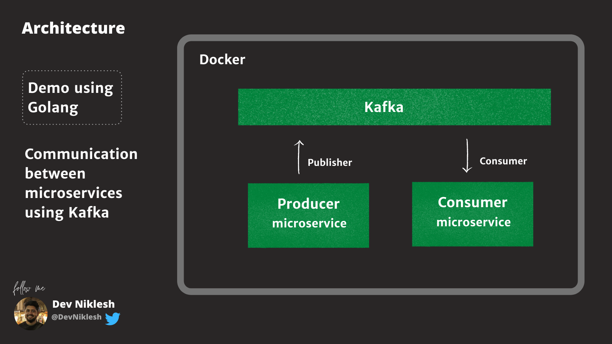

# Golang Messenger using Kafka (producer/consumer)



## To run app locally


```bash
git clone https://github.com/DevNiklesh/kafka-producer-consumer-go.git
cd kafka-producer-consumer-go
```
```bash
docker-compose up
```

You can see message being sent to Kafka from Producer via Cron Jobs and consumed my consumer.